# CoreLight

> **KMU Coop Defense**  
> 국민대학교 2026 캡스톤디자인 12팀  
> FPS 전투와 탑다운 건설을 결합한 2인 비대칭 협동 디펜스 게임

  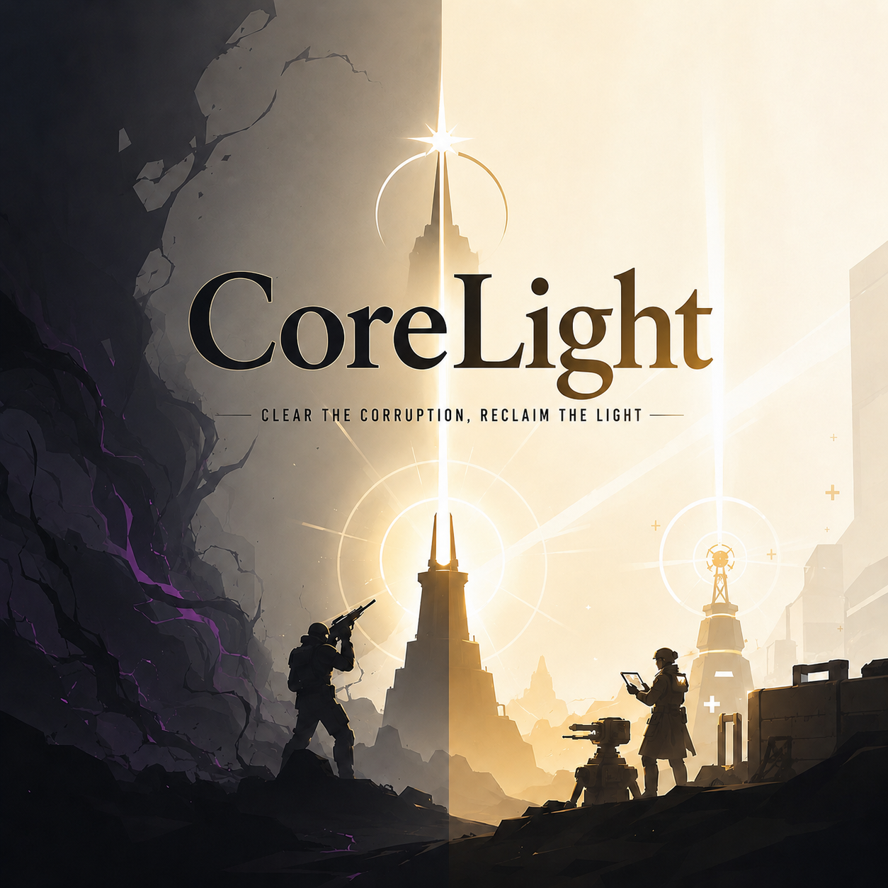

---

## 목차

1. [프로젝트 소개](#프로젝트-소개)
2. [프로젝트 포스터](#프로젝트-포스터)
3. [게임 목표](#게임-목표)
4. [주요 기능](#주요-기능)
5. [시스템 아키텍처](#시스템-아키텍처)
6. [기술 스택](#기술-스택)
7. [팀원 소개](#팀원-소개)
8. [실행 안내](#실행-안내)

---

## 프로젝트 소개

**CoreLight**는 한 명은 FPS 시점의 **Shooter**로 직접 전투를 수행하고, 다른 한 명은 탑다운 시점의 **Supporter**로 건설과 지원을 담당하는 2인 비대칭 협동 디펜스 게임입니다.

플레이어는 몰려오는 적으로부터 **CommandTower**를 방어하면서, 오염의 근원인 **SpawnCore**를 모두 파괴해야 합니다.

Shooter는 어둠 속에서 제한된 시야와 전투 압박을 견디며 목표를 공격하고, Supporter는 포탑, 장벽, 정화 구조물, 보급 아이템을 활용해 전장을 지원합니다.

이 프로젝트는 FPS의 직접 전투감과 RTS/타워디펜스의 전략성을 역할 분담 구조로 결합한 협동 게임입니다.

---

## 프로젝트 포스터

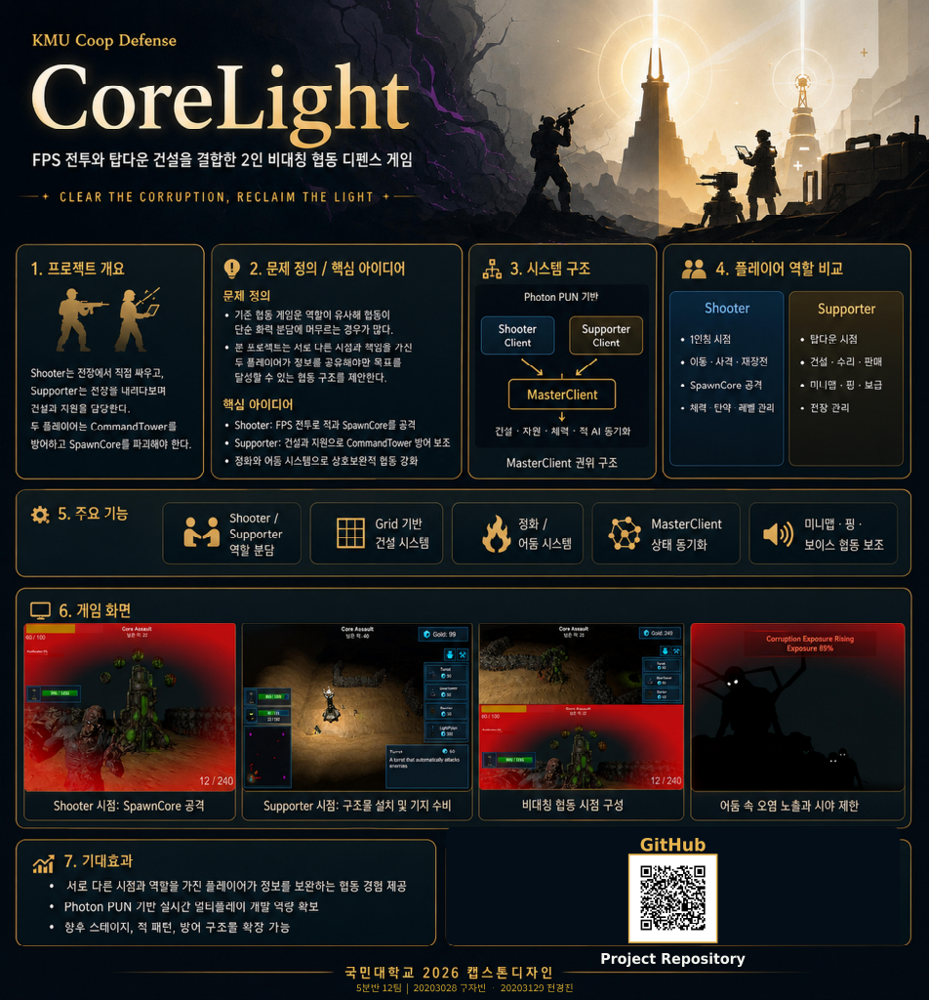

---

## 게임 목표

| 목표 | 설명 |
|---|---|
| **CommandTower 방어** | 밀려오는 적으로부터 아군 핵심 거점을 끝까지 지켜야 합니다. |
| **SpawnCore 파괴** | 적의 근원인 SpawnCore를 모두 파괴하면 승리합니다. |
| **어둠 극복** | 정화되지 않은 구역에서는 Shooter가 큰 위험을 감수해야 하므로 Supporter의 지원이 중요합니다. |
| **역할 보완** | Shooter의 전투력과 Supporter의 전략 판단이 맞물릴 때 목표를 달성할 수 있습니다. |

  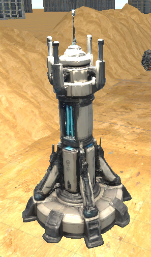
  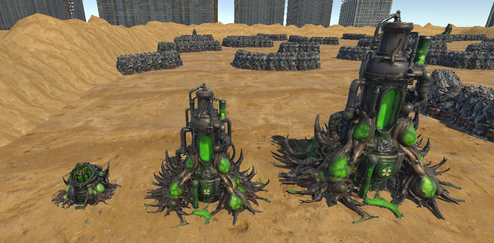
  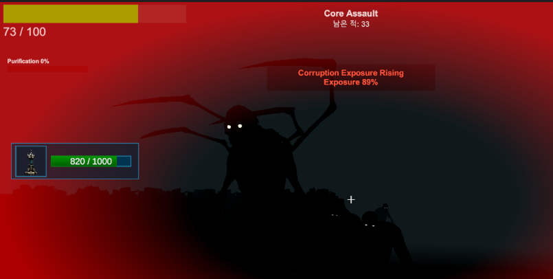

---

## 주요 기능

### 1. 서로 다른 화면과 역할을 가진 2인 협동

| Shooter | Supporter |
|---|---|
| FPS 시점에서 직접 이동, 사격, 재장전, 목표 공격을 담당합니다. | 탑다운 시점에서 전장을 관리하고 건설, 수리, 보급, 핑을 담당합니다. |
| 현장 전투와 SpawnCore 파괴를 주도합니다. | 방어선 구축과 Shooter 생존 지원을 담당합니다. |

  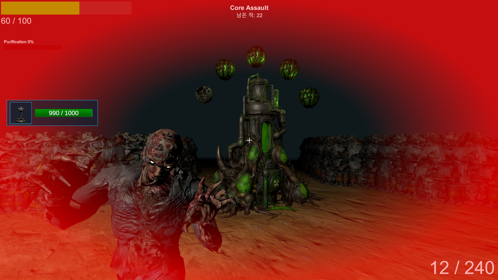
  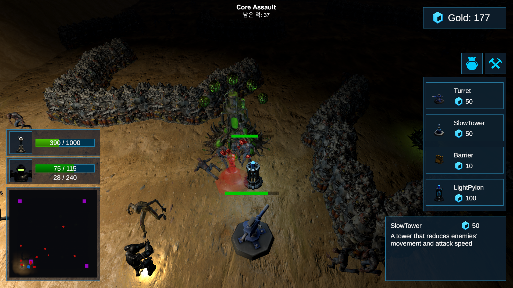

### 2. CommandTower 방어와 SpawnCore 파괴

적은 **EnemyNest**에서 생성되어 **CommandTower**를 향해 진격합니다.  
플레이어는 방어선을 구축해 CommandTower를 지키면서, Shooter가 적진으로 전진해 **SpawnCore**를 파괴할 수 있도록 협력해야 합니다.

  

### 3. 어둠과 정화 시스템

SpawnCore는 주변의 정화 에너지를 흡수해 전장을 어둠으로 뒤덮습니다.  
Shooter는 정화 구역 밖에서 시야 제한과 전투 불리함을 겪기 때문에, Supporter가 **LightPylon**과 정화 지원을 통해 안전 구역을 확장해야 합니다.

  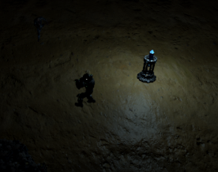

### 4. Grid 기반 건설 시스템

Supporter는 Grid 기반으로 구조물을 설치하며, 설치 가능 여부는 Ghost Preview로 확인할 수 있습니다.  
건설 요청은 네트워크를 통해 MasterClient가 검증한 뒤 양쪽 플레이어에게 동기화됩니다.

| 구조물 | 역할 |
|---|---|
| **Turret** | 범위 내 적을 자동 공격하는 핵심 방어 구조물 |
| **SlowTower** | 적의 이동과 공격 속도를 낮춰 전투 시간을 확보하는 구조물 |
| **Barrier** | 적의 이동 경로를 지연시키는 방어벽 |
| **LightPylon** | 정화 구역을 제공해 Shooter의 활동 범위를 넓히는 지원 구조물 |

  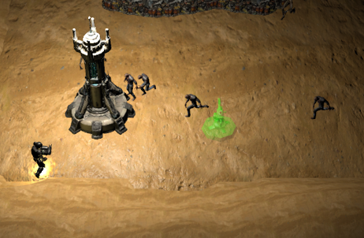

### 5. 협동 보조 시스템

서로 다른 화면을 보는 두 플레이어가 같은 전장을 이해할 수 있도록 미니맵, 핑, Shooter 상태 UI, 음성 채팅을 제공합니다.

| 시스템 | 설명 |
|---|---|
| **미니맵** | Supporter가 전장 전체 상황을 파악하고 카메라를 이동할 수 있습니다. |
| **핑** | 위험 지역, 도움 요청, 일반 위치 정보를 양쪽 플레이어가 공유할 수 있습니다. |
| **Shooter 상태 UI** | Supporter가 Shooter의 체력, 탄약, 부활 상태를 확인하고 지원 시점을 판단할 수 있습니다. |
| **Photon Voice** | 음성 채팅으로 실시간 협동 전략을 주고받을 수 있습니다. |

  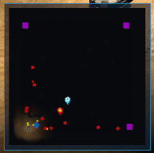

---

## 시스템 아키텍처

본 프로젝트는 **Photon PUN 2** 기반의 2인 멀티플레이 구조를 사용합니다.  
각 클라이언트는 행동 요청을 보내고, 핵심 게임 상태는 **MasterClient**가 검증한 뒤 RPC를 통해 두 플레이어에게 동기화합니다.

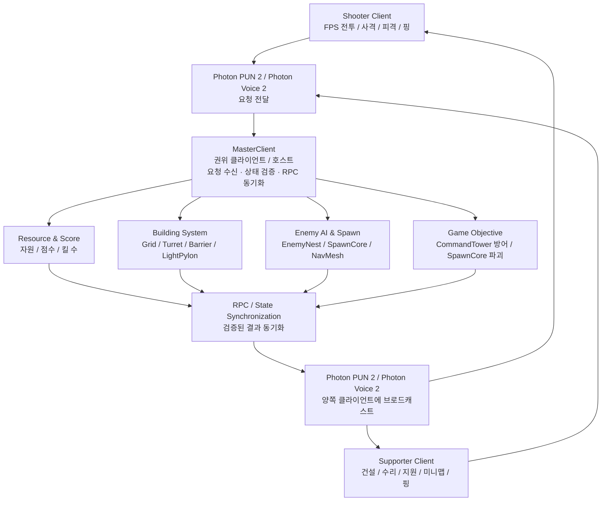

| 구분 | 역할 |
|---|---|
| **Shooter Client** | 이동, 사격, 피격, 핑 등 전투 중심 입력을 요청합니다. |
| **Supporter Client** | 건설, 수리, 판매, 지원 아이템 배치를 요청합니다. |
| **MasterClient** | 자원, 체력, 적 AI, 건설 위치, SpawnCore 상태 등 핵심 게임 상태를 검증합니다. |
| **RPC Sync** | 검증된 결과를 모든 클라이언트에 반영합니다. |

---

## 기술 스택

| 분야 | 사용 기술 |
|---|---|
| Game Engine | Unity 2022.3.62f3 |
| Language | C# |
| Multiplayer | Photon PUN 2 |
| Voice Chat | Photon Voice 2 |
| Rendering | Universal Render Pipeline |
| AI | Unity NavMeshAgent |
| UI | Unity UI, TextMeshPro, figma |
| Version Control | Git, GitHub |

---

## 팀원 소개

| 사진 | 이름 | 학번 | 담당 역할 | GitHub |
|---|---|---|---|---|
|  | 구자빈 | 20203028 | Shooter 플레이어, 게임 시스템, 적 AI, 오디오, 맵, 렌더링 | [@GitHubID](https://github.com/) |
|  | 전경진 | 20203129 | Supporter 플레이어, 건설 시스템, 정화 시스템, 네트워크 | [@Jeon-kj](https://github.com/Jeon-kj) |

---

## 실행 안내

### 실행 환경

- Unity 2022.3.62f3
- Photon PUN 2
- Photon Voice 2
- Windows PC 권장

### 실행 방법

1. Unity Hub에서 프로젝트를 엽니다.
2. 필요한 외부 에셋을 `Assets/Z_Assets` 경로에 배치합니다.
3. `Assets/Project/Scenes/MainMenu.unity` 씬에서 실행합니다.
4. 방을 생성하거나 4자리 방 코드로 참가합니다.
5. 두 플레이어가 각각 Shooter / Supporter 역할을 선택하고 Ready를 누르면 게임이 시작됩니다.

자세한 에셋 설치 방법과 개발 환경 설명은 GitHub 저장소의 README를 참고하세요.

---

## 프로젝트 정보

| 항목 | 내용 |
|---|---|
| 프로젝트명 | CoreLight |
| 개발 기간 | 2026.02 ~ 2026.06 |
| 소속 | 국민대학교 소프트웨어학부 캡스톤디자인 |
| 팀 | 12팀 |
| GitHub | [2026-capstone-12](https://github.com/kookmin-sw/2026-capstone-12) |
